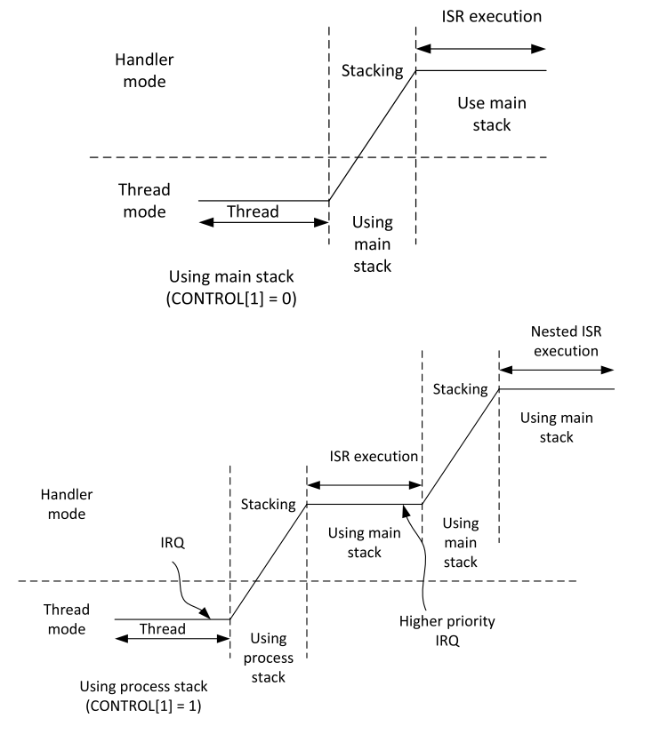

# Respuesta a preguntas orientadoras

### Clase: Arquitectura de Mircroprocesadores

#### Curso de especialización en Sisteas Embebidos

### Preguntas:

1. **Describa brevemente las diferencias entre las familias de procesadores Cortex M0, M3 y  M4.**

    La diferencia básica entre las familias de microprocesadores Cortex M0, M3 y M4 son los componentes o recursos disponibles en su arquitectura. Los Cortex M0 son la arquitectura Cortex más sencilla y los cortex M4 va aumentando la complejidad y la cantidad de recursos disponibles. A continuación se listan algunas de las características que los diferencian:

    **Cortex M0:**

    - **SysticTimer:** opcional, depende del fabricante.
    - **MPU:** no implementada (pero es opcional en el Cortex M0+)
    - **CPU Cahé:** no implementada.
    - **Arquitectura de memoria:** Von Neumann.
    - **Arquitectura ARM:** ARMv6-M.

    **Cortex M3:**

    - **SysticTimer:** implementado.
    - **MPU:** opcional, depende del fabricante.
    - **CPU Cahé:** no implementada.
    - **Arquitectura de memoria:** Harvard.
    - **Arquitectura ARM:** ARMv7-M.

    **Cortex M4:**

    - **SysticTimer:** implementado.
    - **MPU:** opcional, depende del fabricante.
    - **CPU Cahé:** posible,  depende del fabricante.
    - **Arquitectura de memoria:** Harvard.
    - **Arquitectura ARM:** ARMv7E-M.

2. **¿Por qué se dice que el set de instrucciones Thumb permite mayor densidad de código? Explique**

    Actualmente El set de instrucciones Thumb de Cortex-M incluye instrucciones de 16 bits y de 32 bits. Por otro lado, la arquitectura inicial de Cortex-M trabajaba con un set de instrucciones de 32 bits llamada instrucciones ARM. Cuando inició Thumb, lo hizo con instrucciones de 16 bits, lo cual permitía reducir el espacio en memoria para almacenar las instrucciones (esto se traduce en mayor densidad de código), sacrificando funcionalidad, es decir, con menos bits para las instrucciones, puedes pasar menos información por cada instrucción. Además, se podía seguir usando las instruciones ARM de 32 bits, pero el programador tenía que señalizar  en el código fuente (hacer switch), entre el código para ARM y para Thamb, lo cual generaba confuciones.

    Debido a que ahora el set de instrucciones cambió a Thumb2, éste soporta instrucciones tanto de 16 bits como de 32 bits sin tener que hacer el switch, por lo cual, la programación con este set de instruciones es más ágil.

3. **¿Qué entiende por arquitectura load-store? ¿Qué tipo de instrucciones no posee este tipo de arquitectura?**

    La arquitectura load-store literalmente significa cargar-guardar, indica que en los procesadores Cortex-M los datos deben cargarse desde la memoria, procesarse y luego volver a escribirse (guardarse) en la memoria utilizando instrucciones separadas. Por ejemplo, para incrementar un valor de datos almacenado en SRAM, el procesador necesita usar *una instrucción* para "cargar" (leer) los datos desde la SRAM y "cargarlos" (guardar) en un registro dentro del procesador, *una segunda* instrucción para incrementar el valor del registro y luego *una tercera* instrucción para volver a escribir el valor en la memoria.

4. **¿Cómo es el mapa de memoria de la familia?**

    Debido a que la arquitectura de los cortex-M es de 32 bits, la mayor cantidad de memoria direccionable por un bus de este tamaño es de 4Gb, sin embargo, toda esta memoria no se usa como memoria principal. Por lo tanto se ha dividido (y cada fabricante puede hacerlo a su gusto) en 4 partes o regiones según el uso:

    - Memoria de programa
    - Memoria de datos
    - Acceso a periféricos
    - Acceso a Control interno del procesador y componentes de debug.

    A continuación, se presenta el mapa de memoria definido por ARM:

    

5. **¿Qué ventajas presenta el uso de los “shadowed pointers” del PSP y el MSP?**
    
    El término "shadowed pointer" se refiere a que se usan dos stak pointers (SP), uno para funciones de OS Kernel y manejadores de interrupciones (Main SP, MSP) y otro para las tareas que se ejecuten en las aplicaciones (Processor SP, PSP).
    
    Cuando se trabaja en aplicaciones de bare metal, el PSP se puede ignorar y se trabaja simplemente con el MSP. Pero,cuando se implementan soluciones que utilizan un RTOS o un OS Kernel, el uso del "shadowed pointer" es muy práctico, ya que permite separar los SP del modo thread priviligiado (OS Kernel) y del modo handler (excepciones) por un lado y los del modo thread usuario por otro lado. De esta forma, si llegase a fallar el PSP, el MSP seguiría funcionando.

    Cuando el procesador arranca lo hace utilizando el SP apuntando al MSP y  para cambiar de MSP a PSP se hace con un bit en el registro de control. En el stack se guardan todas las variables declaradas en una función (locales) y con ellas se puede acceder a funciones de interrupciones el SP.

6. **Describa los diferentes modos de privilegio y operación del Cortex M, sus relaciones y como se conmuta de uno al otro. Describa un ejemplo en el que se pasa del modo privilegiado a no priviligiado y nuevamente a privilegiado.**

    Los procesadores Cortex-M tiene dos niveles de privilegio que son:
    - **Modo privilegiado:** este modo permite el acceso a todas las áreas de memoria del sistema, sin restricción alguna. En este modo se permite escribir cualquier registro. Es tipico operar en este modo siempre que se usan aplicaciones del tipo bare metal. Ejemplo de esto sería, poder escribir en el registro de control.
    - **Modo no privilegiado:** en este modo la aplición tiene acceso limitado a los registros del sistema, y se le denegará el acceso siempre que intente a acceder a registros especiales como por ejemplo el registro de control. En aplicaciones que usan un OS kernel o un RTOS, el OS siempre corre en modo privilegiado y las tareas en modo no privilegiado (aunque esto puede ser modificado a través del OS).

    El cambio de modos de privilegio se hace a través del registro CONTROL, el cual solo puede accederse desde el modo privilegiado.

    Además, dos modos de operación:
    - **Modo Handler:** este modo es el que se usa para manejar todas las excepciones. En este modo, la aplicación funciona en modo privilegiado siempre.
    - **Modo Thread:** este modo es el que se usa cuando se ejecuta el código de aplicación normal y puede estar en modo privilegiado o en modo no privilegiado.

    Una vez se ha accedido a la CPU en desde el modo thread no priviligiado, no es posible volver a tomar el modo thread priviligiado. La única forma de cambiar a modo privilegiado es a través del modo Handler, el cual siempre tiene privilegios de acceso.

    Un ejemplo es pasar del modo privilegiado thread al no privilegiado thread (por decisión de la aplicación), luego al ocurrir una interrupción (NMI u otra) al modo Handler, en este modo modificar el registro CONTROL para luego al privilegiado thread.

7. **¿Qué se entiende por modelo de registros ortogonal? Dé un ejemplo**

    El modelo de registros ortogonal implica que cualquier operación de la ALU podrá usar como operador cualquier registro del micro y su salida (resultado de la operación) podrá guardarse también en cualquier registro. Cuando se realiza una operación de movimiento de registros, este movimiento puede hacerse des de un registro "a" hasta un registro "b".

8. **¿Qué ventajas presenta el uso de intrucciones de ejecución condicional (IT)? Dé un ejemplo**

    Las instrucciones de ejecución condicional permiten modificar el flujo de un programa según las necesidades de ejección. Esto es, permiten evaluar las condiciones de procesamiento actual para ejecutar una o otra instrucción. 

    Ej_2.: Cuando se requieren hacer bucles para ejecutar acciones iterativas. Para esto, se hace una operación de resta de una variable (numero_iteraciones), la cual va a ir disminuyendo a medida que se ejecutan las interaciones, cuando ésta sea cero se deberá usar el sufijo ***NE*** para validar que el flag Z es 0 y con base en eso ejecutar una instrucción que salga del ciclo repetitivo o continuar en él:

        asm_zeros:
            mov 	r2, 0       
        .asm_zeros_for:
            str 	r2, [r0], 4 
            subs 	r1, 1 
            bne  	.asm_zeros_for
            bx 		lr
    
9. **Describa brevemente las excepciones más prioritarias (reset, NMI, Hardfault).**
    **Reset:** es la excepción con mayor prioridad en el vector de interruciones y corresponde a las propias de la arquitectura ARM. Es decri, esta excepción está definida por la propia arquitectura. Esta excepción hace que el microcontrolador se reinicie incondicionalmente. 

    **NMI:** *Non-Maskable Interrupt*, esta excepción se puede generar desde un periférico o desde una fuente externa. Los periféricos que pueden causar una NMI son el Watch Dog Timer o el Brown-out Detector.

    **Hard Fault:** Maneja todas las fallas como excepciones, si el manejador de fallas de la fuente de falla indicada no está habilitado. Es decir, es el manejador de fallas por defecto. El Hard Fault Handler siempre está habilitado. Al igual que *reset* está definido por ARM. El *Hard Fault Status Register* permite monitorear las fuentes de fallas. A continuación, se detallan los flags que es posible monitorear:

   *DEBUGEVT:* Indica que el evento de depuración ocasionó una falla.

    *FORCED:* Indica una falla de bus, una falla de administración de memoria o una falla de uso.

    *VECTBL:* Indica que hay una falla en una operación del "vector fetch" (búsqueda de direcciones en el stack).

    *EXTERNAL:* indica que el evento de depuración es causado por una señal externa (la señal EDBGRQ es una entrada en el procesador, que normalmente se usa en el diseño de varios procesadores para la depuración sincronizada).

    *VCATCH:* indica que el evento de depuración es causado por un "vector catch" (mecanismo del debugger), una función programable que permite que el procesador se detenga automáticamente cuando ingresa cierto tipo de excepción del sistema, incluido el reinicio.

    *DWTTRAP:* Indica que el evento de depuración es causado por un punto de observación.

    *BKPT:* Indica que el evento de depuración es causado por un punto de interrupción.

    *HALTED:* Indica que el procesador se detuvo debido a una solicitud del depurador (incluido un solo paso).

10. **Describa las funciones principales de la pila. ¿Cómo resuelve la arquitectura el llamado a funciones y su retorno?**

    La pila o stack es un sistema de memoria cuyas función es el almacenamiento temporal de:

    - La dirección de memoria del program counter.
    - El valor de variables cuando se llaman a funciones. 
    - El valor de registros diferentes al r0 a r3, cuando las funciones que se llaman tienen más de 4 parámetros.
    - El estado del procesador cuando ocurre una interrupción
    - Entre otras. 

    Además, el stack tiene una estructura tipo LIFO (Last In First Out), es decir, almacena la información ordenadamente según su entrada en el stack y la entrega primero la que entró de último.

    **Llamado a funciones:** cuando se llama a una función, la arquitectura almacena en el stack el PC (program counter) desde la posición en que se llama  + una posición, (es decir PC+4), además de los registros involucrados; luego el programa salta hacia donde hata sido llamda la función. Cuando se aplica una instrucción de retorno, el estack devuelve el PC+4, de la última función que hizo una llamada y los registros asociados. De esta forma, se entrega ordenadamente los retornos desde la última llamada realizada junto con la información de su contexto.

11. **Describa la secuencia de reset del microprocesador.**

    El microprocesador puede tener 3 tipos de reinicio:
        - *Power on rest*: reinicia todo en el microcontrolador. Es decir, el microprocesador, los periféricos y los componentes de debug. 
        - *System reset*: reinicia sólo el microprocesador y los periféricos, pero mantiene conectado el microcontrolador en el modo debug. 
        - *Processor rest*: sólo reinicia el microprocesador.

    La secuencia de reset es la siguiente: 
    - El microprocesador lee las dos primeraspalabras de la memoria
        - En esta ubicación se encuentra la dirección base del MSP y y el vector de reset. 
    - El microprocesador carga el MSP y el PC con estos valores respectivamente. 
    - Luego de esto, según la dirección que tenga el PC, será la instrucción a la que se le hará el *fetch* para empezar a cargar la *pipeline*, de esta manera se empezrán a ejecutar las instrucciones. 

    **Nota.** Es necesario cargar de inmediato el MSP, debido a que mientras se reinicia el microcontrolador, pueden ocurrir otras excepciones con la NMI y Hardfautl, y por lo tanto, se requiere guardar el estado del microcontrolador. 

12. **¿Qué entiende por “core peripherals”? ¿Qué diferencia existe entre estos y el resto de los periféricos?**

    Los "core peripherals" son los perfiféricos del núcleo, es decir aquellos que están relacionados con las funciones internas del microprcesador y son caracterísitcos de la arquitectura ARM. En este caso, se puden mencinoar los soguientes:

    - Nested Vectored Interrupt Controller (NVIC)
    - System Control Block (SCB)
    - System timer (Systic)
    - Memory Protection Unit (MPU)
    - Data Watchpoint and Trace (DWT)
    - Flash Patch and Breakpoint (FPB)
    - Instrumented Trace Macrocell (ITM)
    - Trace Port Interface Unit (TPIU)
    - Entre otros. 

    Los otros periféricos, son los que definen al microcontrolador como por ejemplo:

    - Módulos I2C
    - Móduclos UART
    - Timers adiconales
    - entre otros.

13. **¿Cómo se implementan las prioridades de las interrupciones? Dé un ejemplo**

    Los Cortex-M tienen un vector de interrupicones que se conoce como NVIC, el cual contiene todas las excepciones del microcontrolador. Contiene un conjunto de excepciones cuyos niveles de prioridad son los más importantes, estas son: reset (-3), NMI (-2) y HardFault(-1). Estos niveles de prioridad están definidos por ARM. Sin embargo, cada fabricante puede añadir más excepciones con nivels de piroridad configurables. El NVIC acepta hasta 256 excepciones más, de las cuales cada una puede tener de 0 a 128 niveles de prioridad (entre más bajo es el valor, más alta es la prioridad).

14. **¿Qué es el CMSIS? ¿Qué función cumple? ¿Quién lo provee? ¿Qué ventajas aporta?**

    MSIS es el acrónimo de "*Cortex Microcontroller Software Interface Standart*", la cual es una HAL que no depende del fabricante (es proporcionada por ARM). Esta HAL brinda soporte para:

        - El controlador de interrupciones del sistema (NVIC).
        - Control del Systic Timer.
        - Drivers genéricos para los diferentes periféricos.
        - Proporciona una API para la implementación de sitemas operativos en tiempo real.
        - Funciones de acceso especial para introducción de código ensamblador.
        - Define los registros estandar de la arquitectura ARM.
        - Entre otras.

15. **Cuando ocurre una interrupción, asumiendo que está habilitada ¿Cómo opera el microprocesador para atender a la subrutina correspondiente? Explique con un ejemplo**

    Una interrupción debe pasar por los siguientes estados:

    - Ocurrencia: ocurre la interrupción
    - Aceptación: el microprocesador acepta la interrupción
    - Stacking: se almacena en el stack todos los registros, creando un ***stack frame***. El microprocesador puede usar MSP o PSP para esta operación, dependiendo de si la interrupción ocurrió cuando se estaba usando alguno de los dos tipos de Stack Pointers. A continuación, se muestra un diagrama que ejemplifica esta condición:

        

    - Vector fectch: en paralelo con la operación de stacking, el microprocesador realiza la la operación de búsqueda de instrucciones o ***instruction fetch***, esto gracias a la arquitectura harvard.
    - Modo Handler: luego de lo anterior, el microprocesador entra en modo Handler para ejecutar las instrucciones. En este modo, siempre se usa el MSP.
    - Unstacking: cuando finaliza la ejecución de instrucciones en modo Handler, se verifica el registro EXC_RETURN para verificar con cuál de los dos SP se realizará esta operación. Se devuelve el valor del Program Counter guardado en el stack para que se ejecute ***vector fetch*** en paralelo con unstacking. A continuación, se muestra un diagrama de esta situación:

        

16. **¿Cómo cambia la operación de stacking al utilizar la unidad de punto flotante?**

    En la operación normal de stacking se guardan los registros Return Addres, PSR, LR, R0-R3 y R12 para devolver los valores que llaman a la función.

    Cuando se usa la unidad de punto flontante (FPU), además de guardar los registros descritos anteriormente, en el stack también se deben guardar los registros S0 a S15 y FPSCR (Floating Point Status y Control Register), para almacenar el estado de la FPU. Sin embargo, esto causa que se tenga que reservar más espacio en el stack y que hayan más ciclos de *push*.
    
    Por lo anterior, los cortex-m4 emplean una característica denominada ***Lazy Stacking***, la cual permite reservar el stack para almacenar los registros adicionales de la FPU, pero no se escriben. Si el handler de una excepción requiere del uso de la FPU, estos valores se guardarán en el stack, pero si no es el caso, no se guardarán y al retorno de la excepción, estos registros no se restaurarán del stack porque no han cambiado. Sin embargo, si el microprocesador detecta que se requieren operaciones con la FPU, de inmediato hará el push correspondiente de los registros en el stack. 

17. **Explique las características avanzadas de atención a interrupciones: tail chaining y late arrival.**

    ***Tail chaining:*** consiste en que cuando ocurra el caso de que durante la atención de una interrupción ocurra otra de mayor o igual prioridad, ésta última podrá entrar en estado *pendiente*, hasta que el microprocesador termine de ejecutar la interrupción actual, cuando se termite la interrupción actual atenderá la que está pendiente sin realizar la operación de unstackin y stacking correspondiente. Esto permite reducir el tiempo entre la atención de cada interrupción.

    ***Late arrival:*** esta característica se da para el caso en que si una excepción de mayor prioridad ocurre justo cuando se está ejecutando el stacking de otra interrupción de menor prioridad, la excepción que se atenderá será la de mayor prioridad aunque haya ocurrido después de otra de menor prioridad, siempre y cuando ocurra durante la operación de stacking. 
    Si una excepción ocurre cuando se está ejecutando el unstacking de otra excepción, este proceso se detendrá para atender la nueva interrupción, esto se conoce como *"pop preemption"*. 
    
18. **¿Qué es el systick? ¿Por qué puede afirmarse que su implementación favorece la portabilidad de los sistemas operativos embebidos?**

     SysTick timer: A simple timer included inside the processor. This enables an embedded OS to be used on the wide range of Cortex-M micro-controllers available. Details of the SysTick timer are covered in section 9.5 of this book

19. **¿Qué funciones cumple la unidad de protección de memoria (MPU)?**

    La MPU permite que se puedan proteger contra accesos "peligrosos" las áreas de memoria de un microcontrolador. De esta manera, es posible evitar que determinadas áreas críticas sean accedidas por un sistema operativo o por el programador en tiempo de ejecución y proteger la integridad del sistema.

20. **¿Cuántas regiones pueden configurarse como máximo? ¿Qué ocurre en caso de haber  solapamientos de las regiones? ¿Qué ocurre con las zonas de memoria no cubiertas por las regiones definidas?**

    La máxima cantidad de regiones que se pueden configurar son ***8*** y cada una puede definir su propia dirección de inicio y fin.

    Si dos regiones se solapan, la zona de memoria en la que se encuentra el solapamiento se regirá según los permisos y características de la región definida que tenga mayor númeor de orden. Ej.: si una dirección está en el rango de la región 1 y la región 4, entonces se usará la configuración de la región 4. 

    Si una zona de memoria no está dentro de las regiones definidas por la MPU, todo acceso a estas regiones será bloquedo y se ejecutará una excepción a través del administrador de memoria (MemManagement) o través de un Hard Fault, si el anterior no está habilitado.

21. **¿Para qué se suele utilizar la excepción PendSV? ¿Cómo se relaciona su uso con el resto de las excepciones? Dé un ejemplo.**

    La excepción PendSV (Pended Service Call), se da después de que ocurre una interrupción u otra excepción justo antes del momento en que se deba ejecutar otra tarea (evento del SysticTimer). Esta excepción es muy útil en los cambios de contexto, ya que si una interrupción ocurre justo antes del evento del systic, el cambio de contexto no se podrá ejecutar y se retrasará la ejecución del handler destinado a la interrupción. En los cortex-m4 y m3, no es posible volver al modo thread cuando hay una interrupción pendiente. 

    Para estos casos, se usa la excepción pendSV, a la cual se le debe configurar la prioridad más baja, para que pueda ejecutarse después de otra interrupción o excepción. De este modo, siempre que haya una interrupción, después de esta sobrevendrá la pendSV, y será posible **retrasar el cambio de tarea**, dando espacio a que se termine de ejecutar la excepción que llamó antes del cambio del evento del systic y luego se haga el cambio de contexto correctamente. 

    A continuacion, se muestra un diagrama de esta situción:
    

22. **¿Para qué se suele utilizar la excepción SVC? Expliquelo dentro de un marco de un sistema operativo embebido.**

    La excepción SVC se usa, en el contexto de los sistemas operativos, para otorgarle aun usuario (tarea en modo thread no priviliegiado) acceso a periféricos o memoria protegida (región MPU), que se hayan definido sin acceso para el modo no priviligiado. De esta manera, se hace un cambio de modo, al denominado modo Handler, que siempre tienen privilegios de administrador. A continuación se muestra un diagrama que ilustra esta situación.  

    

### ISA

1. **¿Qué son los sufijos y para qué se los utiliza? Dé un ejemplo.**
    
    Los sufijos son una especie de modificadores del comportamiento de las instrucciones. Estos sufijos permiten indicar un comportamiento esperado por una función. 

    
    Por ejemplo: la instrucción ***LDR*** normalmente carga una palabra en el registro indicado, desde una posición de memoria o con un valor constante definido por el programador. Si el sufijo ***h*** se le coloca delante de la instrucción: ***LDRSH***, la instrucción ***LDR** modificará su comportamiento a: tomar sólo media palabra y la cargará en el registro especificado, haciendo que el resto de bits de la palabra (menos significativos) sean cero. 

2. **¿Para qué se utiliza el sufijo ‘s’? Dé un ejemplo.**

    El sufifo ***s*** sirve para indicar que el valor que se está operando en los registros tienen signo. 
    Ejemplo: cuando se usa con ***LDR***, esta quedará como ***LDRSH*** y permitirá tomar sólo media palabra y la cargará en el registro especificado, teniendo en cuenta que el dato será guardado en complemento a 2 (con signo) si éste es negativo.

3. **¿Qué utilidad tiene la implementación de instrucciones de aritmética saturada? Dé un ejemplo con operaciones con datos de 8 bits.**

    La implementación de instrucciones con aritmética saturada permite modificar el comportamiento del programa cuando en una variable o registro se cargan o se manipulan datos que sobrepasan la dimensión del tipo de dato. La aritmética saturada define que cuando el valor que se carga en una variable es mayor a la capacidad del tipo de dato definido, entonces el valor a cargar será siempre el valor máximo soportado por el tipo de dato. 

    Ejemplo: 

        ldrb r4, [r0], 1
        mul r5, r4, r3
	    usat r5, 12, r5

4. **Describa brevemente la interfaz entre assembler y C ¿Cómo se reciben los argumentos de las funciones? ¿Cómo se devuelve el resultado? ¿Qué registros deben guardarse en la pila antes de ser modificados?**

    Para hacer una corecctea interacción entre C y Assembler, se requiere indicarle a assembler que el nombre de una función será global con la instrucción: 

        .global <*nombre de la etiqueta*>
    Además, en el programa en C, es necesario declarar (incluidos los tipos de datos que recibirá y devolverá) la función que se llamará desde C, la cual debe tener el mismo nombre que la etiqueta global que se declaró en el assembler.

    Dependiendo del número de parámetros que reciba la función, se deberá incializar el stack. Si la función recibe entre 0 y 4 parámetros, no es necesario inicializar el stack para recibir variables. Sin embargo, si se requiere el uso de registros de propósito general, se deben cargarn en el stack estos registros, antes de ser manipulados, para evitar valores inesperados en su uso e inicio. Además, de que cuando se retorne de la función, éstos registros deben quedar igual que cuando se llamó a la función. 

    Los registros en los que se guardan los parámetros que recibe una función son por defecto r0, r1, r2, y r3. Al finalizar, la ejecución de la función, los registros que deben almacenar la información de retorno son r0 para valores de 32bits o r0 y r1 para valores de 64 bits.

5. **¿Qué es una instrucción SIMD? ¿En qué se aplican y que ventajas reporta su uso? Dé un ejemplo.**

    Una instrucción SIMD (Single Instruction Multiple Data), es una instrucción que es capaz de 'despachar' múltiples datos con una sola instrucción a diferentes unidades de procesamiento. Es decir, que los datos son procesados en paralelo, con una misma operación, por diferentes unidades de procesamiento. Para esto, la arquitectura del microcporcesador debe soportar este tipo de instrucciones. Estas instrucciones son útiles en procesamiento multimedia (video y audio) ya que estas requieren un nivel de procesamiento en paralelo.